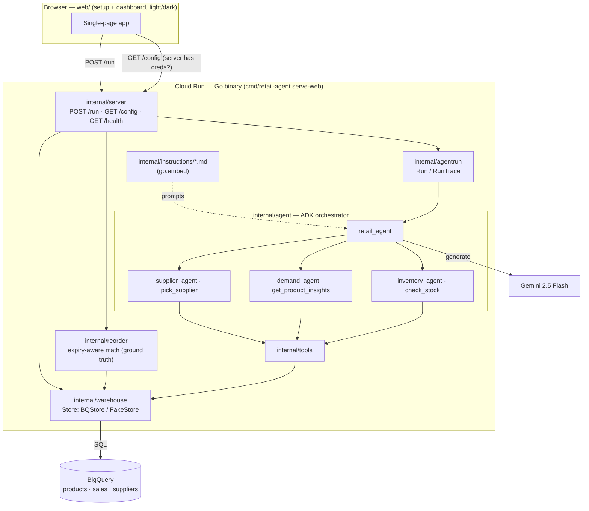

# retail-agent

Retail decision-making agent built with Google ADK in Go. Helps family-run shop owners decide **what to reorder and how much** — reading inventory and sales from BigQuery, forecasting demand, and capping orders so perishables sell before they spoil. Hackathon project for Hack2Skill + Google Cloud AI Decision Making Platform.

The product is a one-button web app: press **See reorder recommendations** and get a dashboard — no prompt to type. Credentials come from either the server's environment (Cloud Run "default credentials") or a one-time in-browser setup, and the dashboard has a switchable light/dark theme.

## Stack

- **Language:** Go 1.26
- **AI:** Google ADK (Agent Development Kit) — orchestrator delegating to inventory, demand, and supplier sub-agents, powered by Gemini (`gemini-2.5-flash`)
- **Data:** BigQuery (`products`, `sales`, `suppliers`)
- **Web:** Go HTTP server + static single-page dashboard (Chart.js), light/dark theme

## Architecture



The deterministic reorder list (`internal/reorder`) is the source of truth; the ADK agents add a plain-language narrative. `POST /run` returns both plus the sales trend and top sellers in one response.

## Quick start

You need: a Google AI Studio API key, a Google Cloud project with BigQuery, and a service-account JSON with BigQuery read access.

**1. Seed demo data into BigQuery** (edit the dataset reference `saanay-genai-adk.retail` in `scripts/seed.sql` to your own `project.dataset` first):

```bash
bq query --use_legacy_sql=false < scripts/seed.sql
```

This creates a `retail` dataset with ~30 branded products (including short-shelf-life perishables like Dutch Lady Milk and Gardenia Bread), ~90 days of sales for most of them, and suppliers.

**2. Start the web app:**

```bash
go run ./cmd/retail-agent serve-web
```

Then open **http://localhost:8080** (set `PORT` to change the port).

**3. In the browser:**

- Paste your **Google AI Studio API key** (get one at https://aistudio.google.com/app/apikey)
- Paste your **service-account JSON**
- Enter your **BigQuery dataset URL** — `your-project.retail` (also accepts `your-project:retail` or `bq://your-project/retail`)
- Press **See reorder recommendations**

The dashboard shows three panels — **Reorder now** (products to order, with quantity and a plain-language reason), **Daily sales trend**, and **Top selling products** — and a header **🌙/☀️ toggle** for light/dark (remembered in the browser).

> **Skip the form:** if the server already has credentials in its environment (`GOOGLE_API_KEY` + ADC BigQuery via `GCLOUD_PROJECT`/`BIGQUERY_DATASET`), `GET /config` reports it and the app goes straight to the dashboard — no setup. A **"Use my own credentials"** link still lets you override in the browser.

> Browser-supplied credentials are sent per request and used only to build that request's clients — never stored on the server. Passing a service-account JSON through the browser is fine for a demo but is not a production auth pattern.

## How it works

The reorder quantity comes from a pure, tested function (`internal/reorder`): forecast demand over the supplier lead time with a safety buffer, then **cap it to what will sell before the product's shelf life** so perishables aren't over-ordered. `POST /run` builds a BigQuery `Store` (from the request's credentials, or the server defaults), computes that reorder list, runs the ADK orchestrator for a plain-language narrative, reads the sales trend + top sellers, and returns them together:

```
JSON { recommendations, narrative, sales_trend, top_sellers }
```

## Endpoints

| Method | Path       | Description                                                          |
|--------|------------|---------------------------------------------------------------------|
| POST   | `/run`     | Runs the agents + reads; returns the full dashboard payload as JSON. Body carries credentials, or is empty `{}` to use server defaults |
| GET    | `/config`  | Reports `{"server_credentials": bool}` — whether the server has default credentials |
| GET    | `/health`  | Health check                                                        |

## Development

```bash
go build ./...                              # build
go test ./...                               # test (agent tests skip without GOOGLE_API_KEY)
go build ./... && go vet ./... && go test ./...   # full CI check
```

For CLI / ADK-launcher use (developer tooling, not the product UI), copy `.env.example` to `.env`, fill it in, then:

```bash
source .env && go run ./cmd/retail-agent            # CLI agent
source .env && go run ./cmd/retail-agent web api webui   # ADK dev web UI
```

The CLI path reads credentials from the environment (`GOOGLE_API_KEY`, and Application Default Credentials + `GCLOUD_PROJECT` + `BIGQUERY_DATASET` for BigQuery); the `serve-web` product path takes them from the browser form instead.

## Structure

- `cmd/retail-agent/main.go` — entrypoint (`serve-web` product server + ADK launcher CLI)
- `internal/agent/` — orchestrator agent, with `inventory/`, `demand/`, `supplier/` sub-agents
- `internal/instructions/` — per-agent prompt markdown, embedded via `go:embed`
- `internal/tools/` — ADK function tools (`check_stock`, `get_product_insights`, `pick_supplier`)
- `internal/reorder/` — pure, tested expiry-aware reorder math
- `internal/warehouse/` — BigQuery client (`Store` interface + `BQStore`; `FakeStore` for tests)
- `internal/server/` — HTTP handlers (`/run`, `/config`, `/health`)
- `internal/agentrun/` — runs the orchestrator programmatically (`Run` / `RunTrace`)
- `internal/eval/` — deterministic agent-response evaluation (skips without `GOOGLE_API_KEY`)
- `internal/models/` — shared domain types
- `web/` — setup + dashboard frontend (`index.html`, `app.js`, `style.css`)
- `scripts/seed.sql` — demo BigQuery data (~30 branded products)
- `docs/` — specs and plans

## Deploy to Cloud Run

The container serves the web app with server-side default credentials, so the
deployed app shows the dashboard with no setup form.

1. Store the Gemini key in Secret Manager:
   ```bash
   printf '%s' "$GOOGLE_API_KEY" | gcloud secrets create GOOGLE_API_KEY --data-file=-
   ```
2. Deploy (BigQuery is read via the service account's ambient credentials):
   ```bash
   gcloud run deploy retail-agent \
     --source . \
     --region <REGION> \
     --service-account retail-agent@<PROJECT>.iam.gserviceaccount.com \
     --set-env-vars GCLOUD_PROJECT=<PROJECT>,BIGQUERY_DATASET=<PROJECT>.retail \
     --set-secrets GOOGLE_API_KEY=GOOGLE_API_KEY:latest \
     --allow-unauthenticated
   ```
3. The service account needs **BigQuery Data Viewer** + **BigQuery Job User** on the dataset's project.

Locally, the same defaults apply when `.env` exports `GOOGLE_API_KEY`,
`GCLOUD_PROJECT`, `BIGQUERY_DATASET`, and `GOOGLE_APPLICATION_CREDENTIALS`
(a service-account JSON): `source .env && go run ./cmd/retail-agent serve-web`
then open http://localhost:8080 — the dashboard appears with no setup form.
